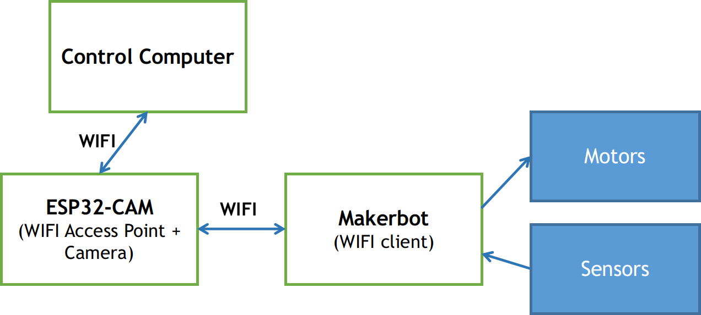

# Starter Code - Viet Nam STEAM Challenge

Repo này chứa mã nguồn cho starter code của Viet Nam STEAM Challenge 2021, cung cấp các ví dụ về điều khiển robot tự hành qua mạch VIA Makerbot và các ứng dụng AI có thể làm được với phần cứng này.

**Thông tin cuộc thi:** <https://via.makerviet.org/vi/docs/vsc-2021/thong-tin/>.

## I. Nạp firmware và kiểm tra phần cứng

### 1. Thiết kế phần cứng

Để chạy được các ví dụ demo, các bạn cần có các linh kiện phần cứng sau:

- Mạch Makerbot để điều khiển động cơ, đọc cảm biến: <https://via.makerviet.org/vi/docs/hardware/design/>. Mạch này đã được BTC tặng cho mỗi đội tham gia.
- Module ESP32-CAM như một phần mở rộng của mạch Makerbot để đọc camera: <https://bit.ly/3fFHPOe>.
- Khung xe robot tròn hoặc một khung xe tương đương có lắp động cơ 5V: <https://bit.ly/3plS8u8>.
- Các linh kiện khác: Pin, sạc, dây nối.

Ở thiết kế cơ bản, chúng ta sẽ dùng ESP32-CAM để làm bộ phát WIFI. Máy tính điều khiển - Control Computer có thể được kết nối vào WIFI này, nhận hình ảnh từ camera. Thông qua WIFI của mạch ESP32-CAM, máy tính điều khiển cũng có thể kết nối tới mạch Makerbot để đọc các giá trị cảm biến và điều khiển động cơ. Mạch Makerbot sẽ hoạt động như một thiết bị client, bắt WIFI của ESP32-CAM, nhận lệnh từ máy tính truyền xuống và đồng thời truyền lại các giá trị cảm biến mà nó đọc được.

**Thông tin kết nối WIFI của mạch ESP32-Cam**

- SSID: `VIA-MakerBot-01`
- Mật khẩu: `makerbotisfun`

Các bạn có thể thay đổi thông tin này bằng cách sửa code và nạp lại firmware.

### 2. Nạp firmware

Trước tiên, chúng ta cần nạp firmware cho mạch Makerbot và module ESP32-CAM.

**Nạp firmware với PlatformIO:** BTC khuyến khích sử dụng PlatformIO được cài đặt trên trình chỉnh sửa code là Visual Studio Code. Sau đó, các bạn có thể nạp firmware bằng cách dùng PlatformIO mở các folder sau, biên dịch và nạp code lên các mạch.

- Firmware cho mạch Makerbot: [Firmware/VIA-Makerbot-Firmware](Firmware/VIA-Makerbot-Firmware).
- Firmware cho mạch ESP32-CAM: [Firmware/VIA-Cam-Firmware](Firmware/VIA-Cam-Firmware).

**Nạp firmware với Arduino IDE:** Trong trường hợp các bạn muốn dùng Arduino IDE cho việc này, có thể tạo các project Arduino mới và sao chép code từ 2 tệp tương ứng như sau:

- Firmware cho mạch Makerbot: [Firmware/VIA-Makerbot-Firmware/src/main.cpp](Firmware/VIA-Makerbot-Firmware/src/main.cpp).
- Firmware cho mạch ESP32-CAM: [Firmware/VIA-Cam-Firmware/src/main.cpp](Firmware/VIA-Cam-Firmware/src/main.cpp).

Đối với Arduino IDE, các bạn cần cài đặt thêm thư viện [Adafruit_PWMServoDriver](https://www.arduino.cc/reference/en/libraries/adafruit-pwm-servo-driver-library/).

### 3. Kiểm tra tín hiệu hình ảnh từ ESP32-CAM

Kết nối vào WIFI `VIA-MakerBot-01` và mở trình duyệt web, truy cập: [http://192.168.4.1](http://192.168.4.1) để xem hình ảnh thu được từ camera.

